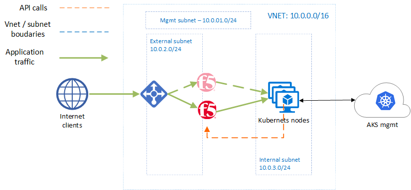
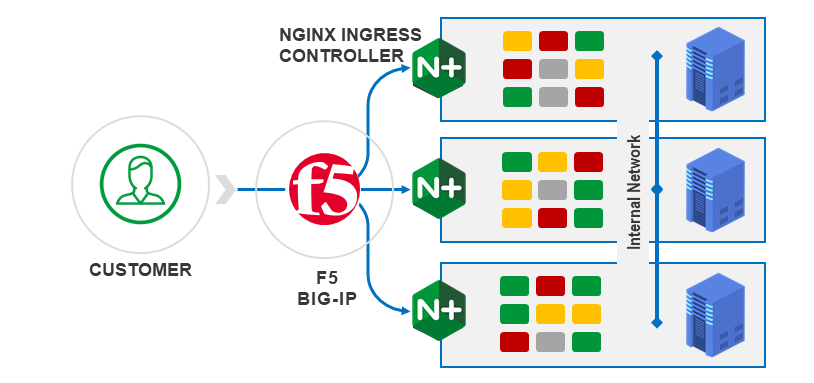

# Better Together: CIS and KIC demo, using Azure Kubernetes Service
This is a demo for the purpose of showing how integration between F5 and K8s can help send traffic into K8s, while NGINX Ingress Controller (KIC) can still play a large role in directing traffic inside the cluster.

Table of contents
=================

<!--ts-->
   * [Purpose and Overview](#purpose-and-overview)
   * [Architecture](#architecture)
   * [Prerequisites](#prerequisites)
   * [Instructions](#instructions)
      * [Deploy Infrastructure](#deploy-infrastructure)
      * [Deploy Application](#deploy-application)
   * [Conclusion](#conclusion)
   * [Support](#support)
<!--te-->
## Purpose and Overview
This demo uses Terraform to deploy a cluster on Azure Kubernetes Service (AKS), and 2x F5 BIG-IP devices. There are then instructions to:
1. Deploy CIS, so that it can configure both devices by exposing pods as pool members in BIG-IP.
2. Deploy KIC. These are the pods that become pool members in F5.
3. Deploy a demo app, whose pods are NOT exposed directly to the internal network, but rather via the NGINX ingress controller.

The demo app can be viewed from the internet if you wish, and instructions for deleting this demo are included also.

## Architecture
### Cloud Infrastructure provisioned

### Focused architecture of traffic flow

## Prerequisites
1. The Terraform version used for this lab is <b>0.14.4</b> 
2. <b>You need details of a ServicePrincipal in Azure.</b>
In this demo your Azure account will be accessed by Terraform using a Service Principal. You can set up a ServicePrincipal by following these instructions. In my example, I use a ServicePrincipal and client secret, but you can also authenticate with client certificate, or Managed Service Identity. <b>The SP should have contributor access in the subscription because it will need to create a Resource Group.</b>

## Instructions

Run git clone to copy the Terraform files we need locally

    git clone https://github.com/mikeoleary/azure-aks-kic-cis.git

> **_NOTE:_**  <b>We will deploy this demo in 2 steps:</b>
>
> 1. We will deploy the <b>infrastructure</b> which consists of Azure VNET and loadbalancer, AKS, and BIG-IP.
> 2. We will deploy the <b>apps</b> onto the Kubernetes environment, including F5's CIS.

### Deploy Infrastructure
Change directories to the infra folder. We will then need to update the file called variables.tf to reflect your own Service Principle details:

    cd azure-aks-kic-cis/infra

... and use your favorite editor to update variables.tf, for example:

    vi variables.tf

You want your variables.tf file to include this below. Obviously, replace my xxx with your SP details, and you can create your own prefix value and Azure location if you wish. Of course, in production, use a better password than below.

<b>Your variable of "prefix" should be unique and all lower case.</b> It will be used to create a Resource Group, along with other resource types.

<b>Your variable of "upassword" should be over 12 characters and contain 3 of the following 4 character types: lower case, upper case, numbers, and special characters.</b> It will be used as the password on the F5 BIG-IP devices, along with the windowsProfile on the AKS cluster.

    #Azure SP cred details
    variable "client_id" {default = "xxxxxxxx-xxxx-xxxx-xxxx-xxxxxxxxxxxx"}
    variable "client_secret" {default = "xxxxxxxxxxxxxxxxxxxxxxxxxxxxxxxx"}
    variable "subscription_id" {default = "xxxxxxxx-xxxx-xxxx-xxxx-xxxxxxxxxxxx"}
    variable "tenant_id" {default = "xxxxxxxx-xxxx-xxxx-xxxx-xxxxxxxxxxxx"}
    #BIG-IP variables
    variable "prefix" {default = "someuniquevalue"}
    variable "uname" {default = "azureuser"}
    variable "upassword" {default = "DefaultPass12345!"}
    variable "location" {default = "East US 2"}
    #Network variables
    variable "network_cidr" {default = "10.0.0.0/16"}
    variable "mgmt_subnet_prefix" {default = "10.0.1.0/24"}
    variable "external_subnet_prefix" {default = "10.0.2.0/24"}
    variable "internal_subnet_prefix" {default = "10.0.3.0/24"}

Now let's run Terraform and build infrastructure! You will need to type "yes" at the last prompt and *you will get billed for resources deployed*.

    terraform init
    terraform plan
    terraform apply 

Note: it may help to <b>wait 2 mins at this point</b> before running the commands in the next step. The BIG-IPs have just been provisioned and we want to be sure they are up and running before sending them REST calls via the next steps.

### Deploy Ingress Controllers
Now let's <b>change directories</b> to install ingress controllers.

    cd ../ingress/

Follow the instructions within the README.md in this location.

### Deploy Application
Now let's <b>change directories</b> to install a demo app.

    cd ../app/

Follow the instructions within the README.md in this location.

### Verify and review your environment
Once this is complete, you will have a running app inside Kubernetes that is exposed to the internet via F5 BIG-IP, and NGINX ingress controller. The value of this demo is not in exposing the app, but in the possibilities that now exist for the application owner, such as:
- using NGINX Ingress Controller as a means to control app traffic, thereby releiving F5 admins of the need for regular updates, or
- applying WAF and security controls at BIG-IP or at NGINX, whichever is preferred by the organization, or,
- managing TLS certificates at BIG-IP, NGINX, or both,
- etc.

### Delete environment 
Finally, don't forget to delete your resources! Again - you'll need to type "yes" when prompted. 
    
Back to the /infra directory to destroy our resources.

    cd ../infra
    terraform destroy

Once in a while, Azure will destroy these resources without considering dependencies, and you'll see an error when you delete your resources. If this happens, just destroy again with the command above, or just delete the Azure Resource Group via the Azure portal.

## Conclusion
Thanks for reading. This demo was intended to show a few things: F5 CIS, NGINX KIC, and specifically using CRD's in your CIS config.

## Support
This repo is not supported by F5. It is a demo that I have put together personally, but I'd be happy if you could submit issues via GitHub.
    
